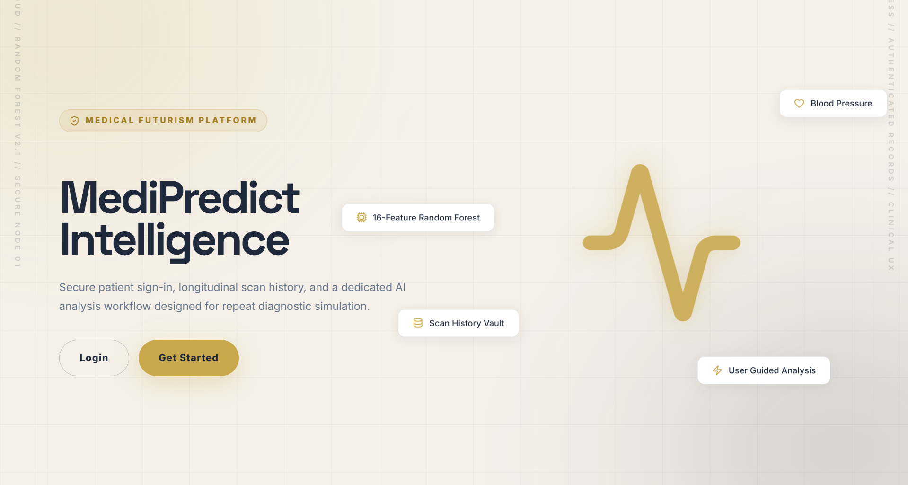
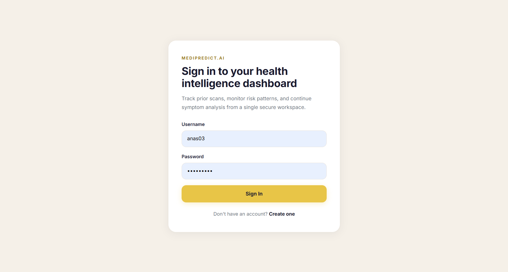
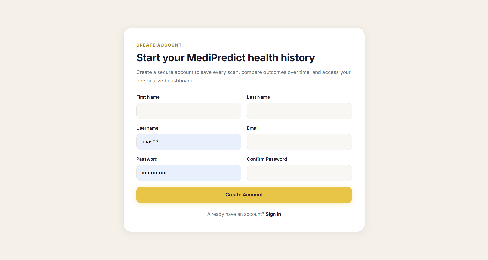
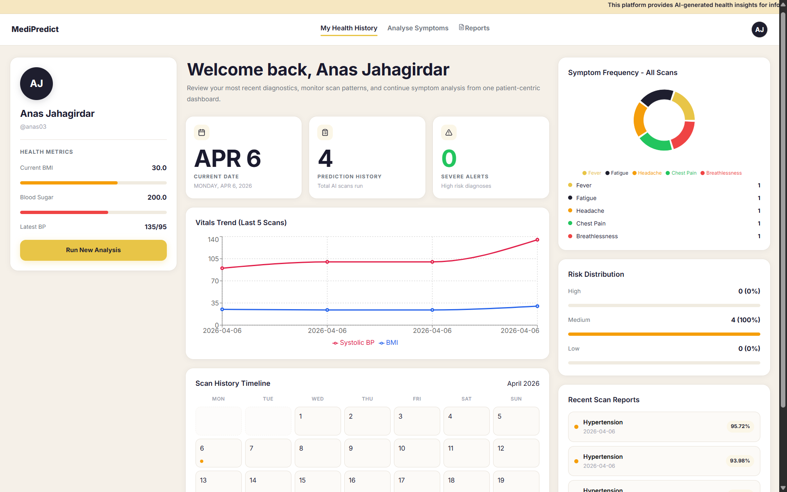
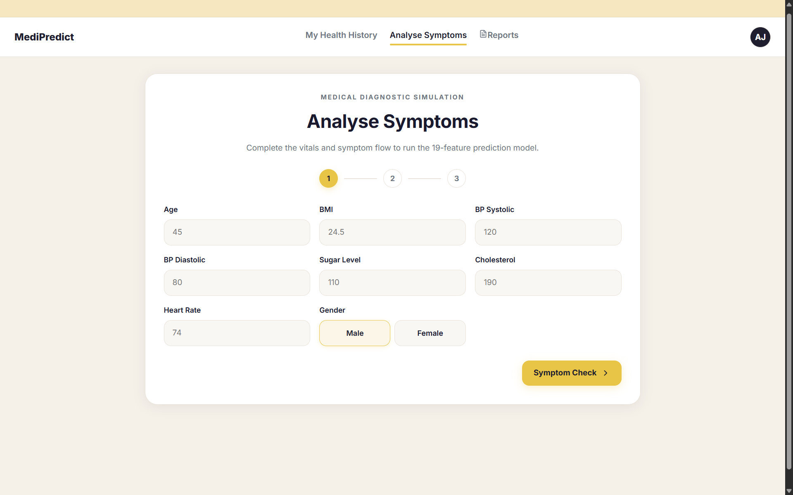
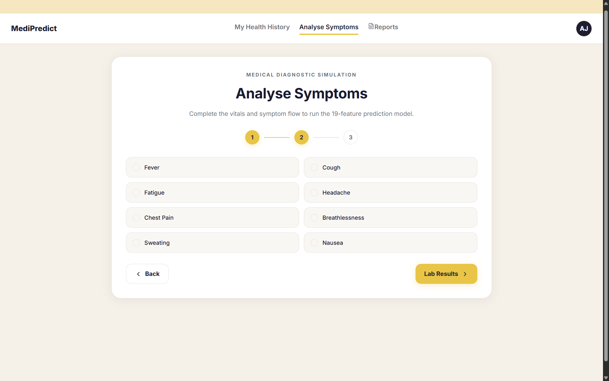
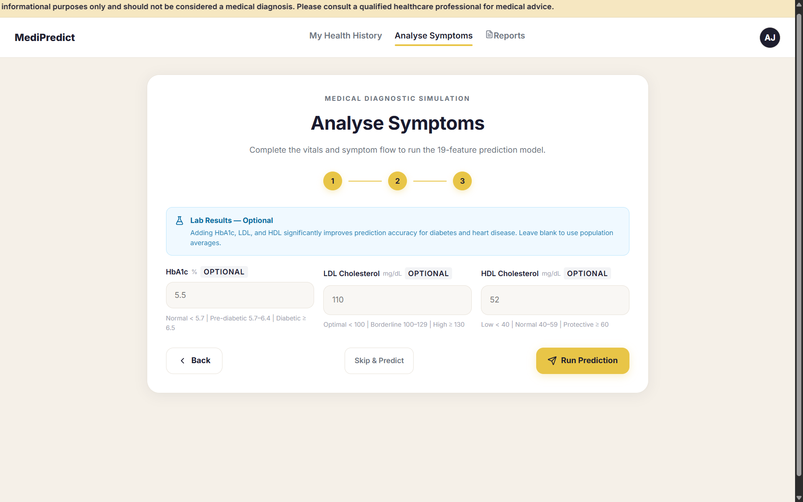
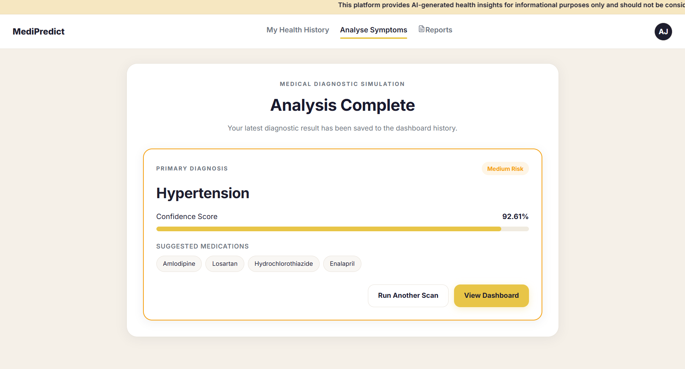
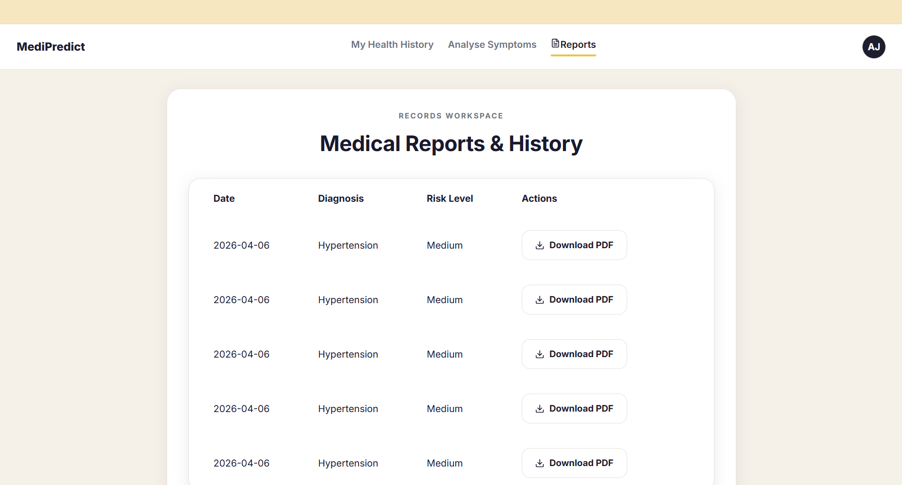

# MediPredict — Clinical Health Risk Prediction Platform



MediPredict is a full-stack clinical health risk prediction platform that uses 
a two-stage Machine Learning pipeline to analyse patient vitals, symptoms, and 
lab results — and predict health risks with confidence scoring, suggested 
medications, and downloadable PDF reports.

> ⚠️ **Disclaimer:** MediPredict is built for educational and simulation 
> purposes only. It is not a substitute for professional medical advice, 
> diagnosis, or treatment.

---

## 🌐 Live Demo

**[https://medipredict.duckdns.org](https://medipredict.duckdns.org)**

---

## 📸 Screenshots

### Landing Page


### Login


### Sign Up


### Dashboard


### Analyse Symptoms — Step 1: Vitals


### Analyse Symptoms — Step 2: Symptoms


### Analyse Symptoms — Step 3: Lab Results


### Prediction Result


### Medical Reports & History


---

## ✨ Features

- 🔐 **JWT Authentication** — Secure register, login, logout with 
  refresh token rotation
- 🧠 **Two-Stage ML Pipeline** — Stage 1 predicts risk level 
  (Low/Medium/High), Stage 2 predicts disease class
- 📊 **19-Feature Prediction Model** — Vitals, symptoms, and optional 
  lab values (HbA1c, LDL, HDL)
- 🏥 **4 Disease Classes** — Diabetes, Heart Disease, Hypertension, Obesity
- 📈 **Confidence Scoring** — Every prediction includes a confidence 
  percentage and low-confidence warning banner
- 💊 **Medication Suggestions** — Clinically mapped medication 
  recommendations per diagnosis
- 📋 **PDF Report Generation** — Downloadable clinical reports via ReportLab
- 📊 **Personal Dashboard** — Vitals trend chart, symptom frequency 
  doughnut, risk distribution, scan calendar, and recent scans
- 🗂️ **Scan History** — Full longitudinal record of every prediction run
- 🔒 **Clinical Safety Features** — Input range validation, lab value 
  defaults, low-confidence flagging, medical disclaimer

---

## 🛠️ Tech Stack

| Layer | Technology |
|---|---|
| Frontend | React + Vite + Tailwind CSS |
| Backend | Django 5 + Django REST Framework |
| Authentication | SimpleJWT (JWT tokens) |
| ML Pipeline | XGBoost + Stacking Ensemble (scikit-learn) |
| PDF Generation | ReportLab |
| Database | SQLite |
| Process Manager | PM2 + Gunicorn |
| Web Server | Nginx + SSL (Let's Encrypt) |
| Cloud | Microsoft Azure VM (Ubuntu 24) |
| CI/CD | GitHub Actions |
| Domain | DuckDNS |

---

## 🤖 Machine Learning Pipeline

MediPredict uses a two-stage prediction architecture:

**Stage 1 — Risk Classification**
- Model: `RandomForestClassifier`
- Output: `Low` / `Medium` / `High` risk
- If risk is `Low` → returns `Healthy`, skips Stage 2

**Stage 2 — Disease Classification**
- Model: `StackingClassifier` (XGBoost + Random Forest + Logistic Regression)
- Output: `Diabetes` / `Heart Disease` / `Hypertension` / `Obesity`
- Returns confidence score, sorted alternative probabilities, 
  and medication suggestions

**Features (19 total):**
bp_systolic, bp_diastolic, sugar_level, cholesterol, heart_rate,
bmi, age, gender, symptom_fever, symptom_cough, symptom_fatigue,
symptom_headache, symptom_chest_pain, symptom_breathlessness,
symptom_sweating, symptom_nausea, hba1c, ldl, hdl
---

## 🚀 Local Development Setup

### Prerequisites
- Python 3.11+
- Node.js 20+
- Git

### Backend Setup
```bash
# Clone the repository
git clone https://github.com/anasjahagirdar/MediPredict.git
cd MediPredict/backend

# Create virtual environment
python -m venv venv
source venv/bin/activate  # Windows: venv\Scripts\activate

# Install dependencies
pip install -r requirements.txt

# Create .env file
cp .env.example .env
# Edit .env with your values

# Run migrations
python manage.py migrate

# Start development server
python manage.py runserver
```

### Frontend Setup
```bash
cd ../frontend

# Install dependencies
npm install

# Create .env file
echo "VITE_API_BASE_URL=http://localhost:8000" > .env

# Start development server
npm run dev
```

---

## 🔑 Environment Variables

### Backend (`backend/.env`)
```env
DJANGO_SECRET_KEY=your-secret-key-here
DJANGO_DEBUG=True
DJANGO_ALLOWED_HOSTS=127.0.0.1,localhost
DB_MODE=local
FRONTEND_PRODUCTION_ORIGIN=http://localhost:5173
```

### Frontend (`frontend/.env`)
```env
VITE_API_BASE_URL=http://localhost:8000
```

---

## 📡 API Endpoints

| Method | Endpoint | Description | Auth |
|---|---|---|---|
| POST | `/api/auth/register/` | Register new user | No |
| POST | `/api/auth/login/` | Login and get JWT tokens | No |
| POST | `/api/auth/logout/` | Logout and blacklist token | No |
| POST | `/api/auth/token/refresh/` | Refresh access token | No |
| POST | `/api/predict/` | Run ML prediction | Yes |
| GET | `/api/dashboard/summary/` | Get dashboard summary | Yes |
| GET | `/api/dashboard/risk-trend/` | Get vitals trend data | Yes |
| GET | `/api/dashboard/symptom-frequency/` | Get symptom counts | Yes |
| GET | `/api/dashboard/scan-history/` | Get all scan records | Yes |
| GET | `/api/reports/download/<id>/` | Download PDF report | Yes |

---

## 🔄 CI/CD Pipeline

Every push to `main` triggers the GitHub Actions pipeline:
Push to main
↓
Django API Tests (Python 3.11)
↓
React UI Build (Node.js 20)
↓
Deploy to Azure VM via SSH
↓
git pull → pip install → migrate
→ npm build → pm2 restart → nginx restart
↓
Live at https://medipredict.duckdns.org ✅

---

## 🗂️ Project Structure

MediPredict/
├── backend/
│   ├── core/
│   │   ├── ml/              ← ML artifacts (.pkl files)
│   │   ├── models.py        ← Database models
│   │   ├── views.py         ← API views + ML inference
│   │   ├── serializers.py   ← DRF serializers
│   │   └── urls.py          ← URL routing
│   ├── health_project/
│   │   ├── settings.py      ← Django settings
│   │   └── urls.py          ← Root URL config
│   ├── requirements.txt
│   └── manage.py
├── frontend/
│   ├── src/
│   │   ├── pages/           ← Page components
│   │   ├── components/      ← Reusable components
│   │   ├── api/             ← Axios API layer
│   │   └── context/         ← Auth context
│   ├── package.json
│   └── vite.config.js
├── .github/
│   └── workflows/
│       └── ci.yml           ← CI/CD pipeline
└── README.md

---

## 🛡️ Clinical Safety Features

- Input validation with strict vital range bounds
- Lab value defaults using population averages
- Low confidence warning banner (threshold: 55%)
- Two-stage pipeline — healthy patients skip disease classification
- Medical disclaimer on every prediction and PDF report
- User-scoped data — no cross-user data access

---

## 📄 License

This project is built for educational purposes as part of a full-stack 
development portfolio.

---

## 👨‍💻 Author

**Anas Jahagirdar**
- GitHub: [@anasjahagirdar](https://github.com/anasjahagirdar)
- Live: [https://medipredict.duckdns.org](https://medipredict.duckdns.org)